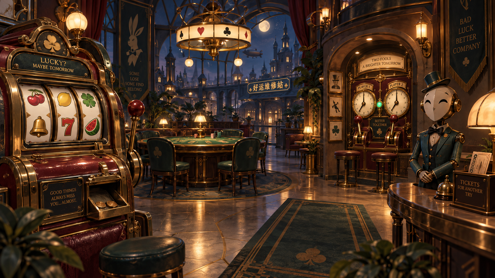
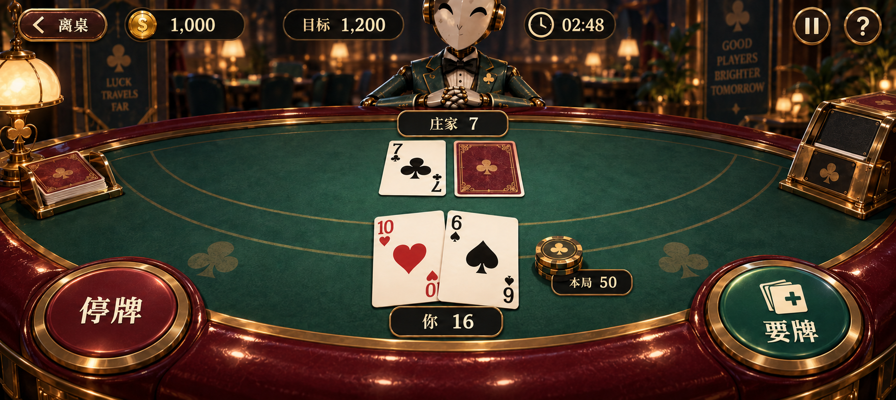

# 体验与美术重做提案（2026-10-02，待审阅）

本提案已被用户随后批准的[PrototypeV2计划](../implementation.md)替代。复杂方向A、手机默认自动靠近和旧兼容保留不再执行；此文只保留研究与提案历史。

当前暂停实现。用户不认可现有手机交互和美术质量；代码通过测试、生成包和新增可见助手不代表S1通过。手头输入修复已收口为cd37c16，本提案不自动恢复Goal，不替换已批准需求，不开始批量制作其余小游戏。

## 现状判断

当前实机/Editor画面的问题不只是缺少几个模型：大面积亮地面、同等醒目的墙面和金边争夺注意；机台像分散陈列的道具，缺少空间主次；多块小字铭牌替代了信息设计；手机需要同时移动、转向、找交互点、读小字，动作成本过高。把弹窗换成模型上的小按钮并不自动获得沉浸感。

以下分开记录来源事实和本项目建议。未确认的流程不补成“原版就是这样”。

## 参考研究

|参考|可核对的资料事实|用于本项目的设计判断|
|---|---|---|
|Gamble With Your Friends|[官方发行预告约0:20](https://www.youtube.com/watch?v=j_WVqza2yRk&t=20)可见实体Plinko钉板、倍率，以及数字键盘/金额/PLAY下注装置；约0:30可见Min/Max与近处朋友的脸和手势。[Steam](https://store.steampowered.com/app/3892270/Gamble_With_Your_Friends/)提供官方媒体。|学习场景连续、结果可见、同伴在场；不能误概括为纯机械操作或没有数字输入。我们可以有清晰的专属数值控件，不必把每条信息做成微小实体字。|
|Astro Bot|[Team Asobi访谈](https://blog.playstation.com/2024/09/09/astro-bot-how-team-asobi-created-a-unified-vision-for-fun/)说明先验证玩法，再由美术强化世界与可玩对象。|操作对象先有清楚轮廓、触感和动作反馈；美术服务这次要做的动作。参考高完成度，而非复制角色或平台品牌符号。|
|It Takes Two|[EA官方玩法说明](https://www.ea.com/games/it-takes-two/it-takes-two/news/it-takes-two-official-gameplay-trailer)把主题、角色能力、互动空间和小游戏联系起来。|入口、补给、机台与离场区域形成有功能的场所，不仅是换色墙壁围住道具。|
|Hearthstone|[手机开发说明](https://hearthstone.blizzard.com/en-us/news/16421347/hearthside-chat-mobile-development-update-10-21-2014)与[手机版说明](https://hearthstone.blizzard.com/en-us/news/18648149/hearthstone-patch-notes-2-5-0-8416-take-hearthstone-anywhere-with-mobile)强调面向小屏的专门界面。|手机牌桌重新构图、重排信息，牌面和本轮动作优先；不把PC布局缩小后交差。|
|Brawl Stars|[官方控制设置更新](https://supercell.com/en/games/brawlstars/blog/release-notes/optional-update-customizable-controls/)提供自定义控制入口。|保留可调整布局与轻量主操作，避免常驻按钮墙；具体移动方案仍需验证，不能把射击游戏控制直接照搬赌场。|

另已查看[官方赛鸭截图](https://shared.fastly.steamstatic.com/store_item_assets/steam/apps/3892270/e3514d1723232a988324d08834e8784e6ad355c2/ss_e3514d1723232a988324d08834e8784e6ad355c2.1920x1080.jpg?t=1790878645)和[官方角色互动截图](https://shared.fastly.steamstatic.com/store_item_assets/steam/apps/3892270/46a2a2c1593b57eb3b8948a68be504e8d91d3912/ss_46a2a2c1593b57eb3b8948a68be504e8d91d3912.1920x1080.jpg?t=1790878645)：机台、多人头脸与手势在同一空间中可见。完整常驻HUD、进入/退出键、是否统一手持终端未由这些官方资料确认；没有实际启动原版完整试玩。第三方录像仅作线索，不用其未知版本证明当前统一布局。

## 手机交互建议

**建议改为：点选机台 → 辅助靠近/入座 → 固定清晰桌面视角 → 操作 → 桌面结算。**

- 手机默认点选与辅助视角；双摇杆自由探索作为可选。PC保留第一人称探索，手柄保留明确焦点导航。这是对旧默认输入方案的变更提案，尚未实施。
- 点选/靠近不能自动下注。下注前明确金额与收益修正，只有带金额的投入操作才扣款。水果机可让“投入并拉动”成为一次明确确认动作，避免金额确认后再重复确认；拖动同时提供点击替代。
- 入座后取消移动与转向负担。二十一点发牌期间只显示进行中状态，轮到玩家才突出要牌/停牌；下注控件在活动牌局中收起。
- 当前投入、可执行动作和结果保持在操作附近；完整规则按需展开，首玩用一句话和一次实际动作教学，不在每台旁挂整页小字。
- 玩家阅读区与手指操作区分开。手机大按钮靠近左右拇指，牌面/仪表不被手指挡住；命中区可大于模型可见尺寸，但不能彼此重叠或穿过遮挡误选。
- [Android触区建议](https://support.google.com/accessibility/android/answer/7101858?hl=en-GB)为至少48dp、留出间隔，可作为起点；这不是把48当Unity固定像素，也不是仅看截图就完成真机验证。不同屏幕与输入应主动适配，见[Android游戏多屏指南](https://developer.android.com/games/develop/all-screens)。

## 美术方向A：复古发条俱乐部

不改游戏名。以深蓝/酒红/翡翠绿建立大色块，黄铜作为局部结构，暖白作为可操作物件与牌面。空间有暗部，但玩法表面要明亮清晰；拉杆、筹码、玻璃转轮、纸牌分别呈现可辨材料。减少均匀金边、无目的管线、重复墙圈和满屏高光。角色与机械表达幽默，环境保持有层次的成年人游乐场气氛。

两图由内置imagegen生成，仅是构图、材质、灯光和界面方向稿；不是游戏截图、模型资产或性能证据。手机版图表示活动牌局：玩家10+6=16，桌边只保留要牌/停牌，投入额为50。牌面图形采用简化单花色中心符号，正式卡牌由规则驱动并使用可校验资源，不能直接把概念图当运行时牌面。

方向稿仍需删减装饰文字、压低部分镜面反射、校准实际字号及拇指遮挡。落地使用烘焙/探针和有限重点光源、共享材质与可控几何；不承诺手机完整复制概念图的光线与反射。首个落地画面应匹配选定构图、主次和材料，而非靠曝光/滤镜掩盖粗糙模型。

## 代码职责重整

已从总体文档移除强制Adapters要求，并同步AGENTS/CLAUDE。现有赌场主要分成Rules和Adapters，后者混入场景表现、交互、UI及多个Controller partial，目录已不能清楚表达职责。

重做时保留已验证的Rules/经济/存档行为；把机台交互、世界表现、UI和冒险流程按其真实职责拆开。可以使用Interaction、Presentation、UI、Persistence等清楚的名字，但这些不是新的全项目固定模板，也不要求先创建所有目录。

Controller只承担场景入口、引用组装和生命周期，不通过大量partial继续吸收教程、购物、成长和全部机台流程。普通规则/流程类接收明确依赖；MonoBehaviour处理需要Unity生命周期和场景引用的部分。只有真实外部接口转换才建立适配器，不为每个类包接口/工厂/转发器。迁移必须核对调用方、GUID、序列化引用及旧档兼容，不能只批量移动目录或改命名空间。本轮尚未执行运行时代码搬迁。

## 下一轮的顺序与门槛

1. 先审阅手机探索流程、桌面信息层级与美术方向；不满意先改稿。
2. 按手机实际尺寸制作可点的交互原型，覆盖投入前、进行中、结果、离桌与恢复，验证误触和理解成本。
3. 选一张牌桌做完整美术切片：按确定图还原模型/材质/灯光/UI/动作，同时按职责整理相关代码。保留旧原型可恢复，不继续叠加临时Builder。
4. 同一机台在Windows键鼠、手柄、手机触屏实玩；先看手感和画面，再扩到另外两台样板。
5. 三台样板和区域达到同一标准后重新提供双端包与演示；用户确认S1后才扩展其它内容。

这只是下一轮建议。原四区、17游戏和双端目标未削减；实现暂停，等待方向反馈，不把本提案或生成图片记为S1已完成。
